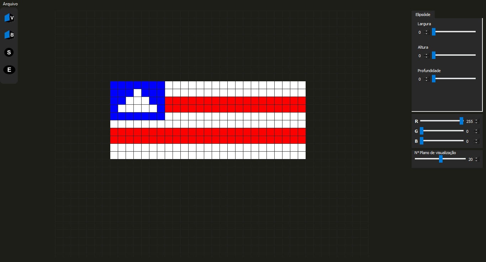

<h1 align="center"> <b>🖌️ Sculptor</b></h1>

| Sample - Keven | 
| :---: |
|  |

## 💻 Project

A graphic interface that implements [Sculptor](https://github.com/raphaelramosds/sculptor-lib) class methods. You can see a introduction to the main funtionalities below

> Sculptor is a Library developed by me for drawing sculptures with volume elements (voxels). Above you've just seen a little sample of the minion Keven, drown by me with Sculptor.

## ⌨️ Shortcuts

Put methods such as put voxel, put box, put ellipsoid and put sphere can be used with **left click**

Cut methods such as cut voxel, cut box, cut ellipsoid and cut sphere can be used with **right click**

`CTRL + N` creates a new sculpture

`CTRL + S` exports a OFF of the sculpture

`CTRL + Q` quit application

## 🖌️ Drawing modes and setting dimensions

Drawing modes can be switched by clicking on the left toolbar. There are four ones: voxel, box, sphere and ellipsoid. Once a mode is chosen, you can set the dimensions of the shape on the tab that will come up in the right side of the interface.

## New sculpture

You can reset your canvas by clicking on `Arquivo > Novo` and set the new dimensions of your canvas.

## 👌 Export your art!

Once you've finished your sculpture you may want to save it on a OFF file. It can be done on `Arquivo > Exportar` and select the directory you want to save it

## 📄 Documentation

The documentation of all classes used here was built with Doxygen. You can access [right here](https://raphaelramosds.github.io/sculptor/interface/)
