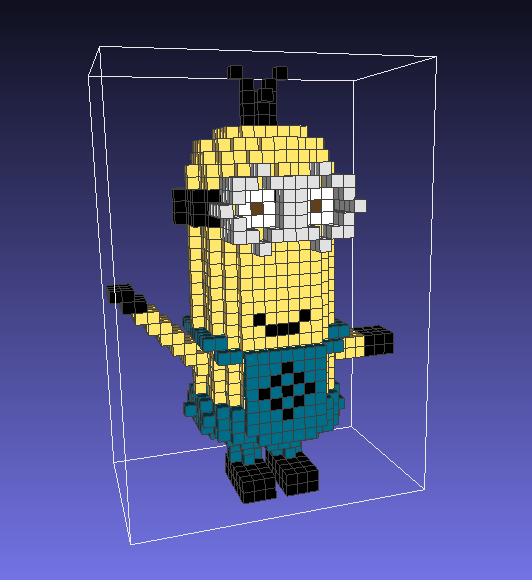

# Sculptor

## Brief explanation

Sculptor is a Library for drawing sculptures with volume elements (voxels).  Below a little sample of the minion Keven, drown by me with Sculptor.

## How to use

You can also use this class. Just clone this repository and see the documentation, available on [Scultpor](#)